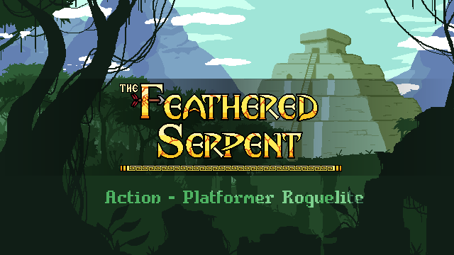

# The Feathered Serpent

## Steam Small Description

The Feathered Serpent ist ein 2D-Action-Platformer mit zufällig generierten Leveln, Gegnern und Gegenständen! Es hat starke Roguelite-Elemente, ein Fortschrittssystem, das permanente Upgrades ermöglicht, und viele Gegenstände und Waffen, die die Art und Weise deines Angriffs verändern.

## Steam Description

The Feathered Serpent ist ein 2D-Action-Platformer, der den rasanten Kampf eines Shooters mit zufällig generierten Leveln, Gegnern und Gegenständen kombiniert! Es hat starke Roguelite-Elemente, mit einem Fortschrittssystem, bei dem man verschiedenen Göttern Blut opfert, um Upgrades zu erhalten. Während du unserem Protagonisten auf seiner Reise folgst, wirst du viele Schätze und Waffen finden, die sich zu einzigartigen Waffen und Kampfstilen kombinieren lassen!

In The Feathered Serpent haben die Spieler die Möglichkeit, eine Vielzahl verschiedener Gebiete zu erkunden, von denen jedes seine eigene Umgebung, seine eigenen Gegner und seine eigenen Belohnungen hat. In jedem der vielfältigen Gebiete gibt es zufällig ausgewählte Level und Herausforderungen, die den Spielern ein Gefühl von echter Erkundung vermitteln und verhindern, dass das Spiel zu repetitiv wird. In echter Roguelite-Manier müssen die Spieler ihre Taktiken und Strategien anpassen und weiterentwickeln, um die Herausforderungen in jedem Gebiet zu überleben und weiterzumachen und aus jedem gescheiterten Versuch zu lernen. Wirst du es schaffen, alle fünf Gebiete zu erobern und zu erforschen und deinen Platz als großer Jäger der Gefiederten Schlange einzunehmen?

Kämpfe dich als wiedergeborener Skelettkrieger durch diese uralte Welt in den verlassenen Reptiltempel. Auch wenn du dein Leben verloren hast, erwacht ein Funke heldenhafter Entschlossenheit in dir, und die einst unüberwindbare Barriere, die als Tod bekannt ist, kann dich nicht aufhalten. Aber du spürst, dass es nicht nur deine Stärke ist, die dieses Kunststück vollbracht hat, sondern welcher Gott hat beschlossen, dir zu helfen? Aber was noch wichtiger ist... warum?

